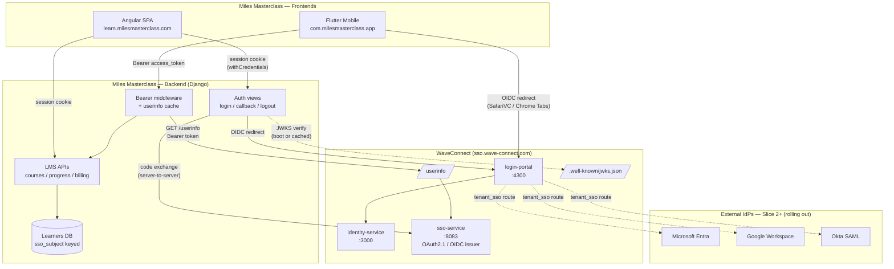
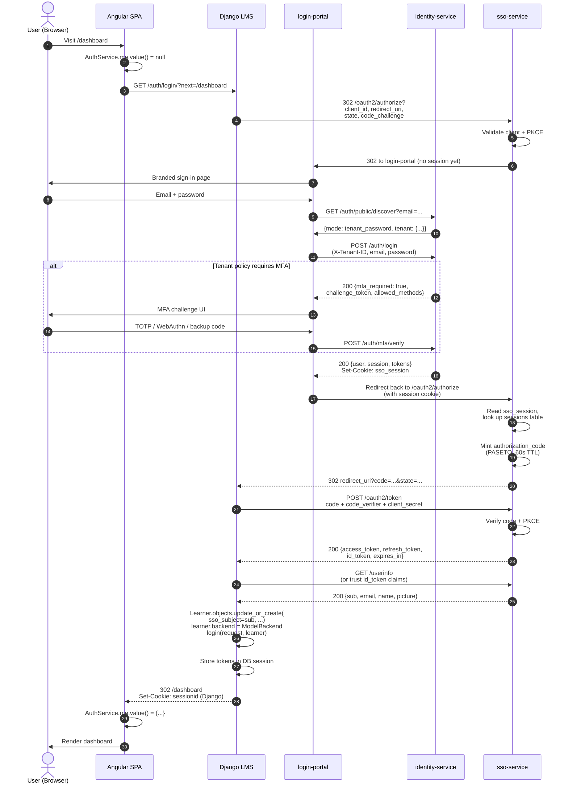
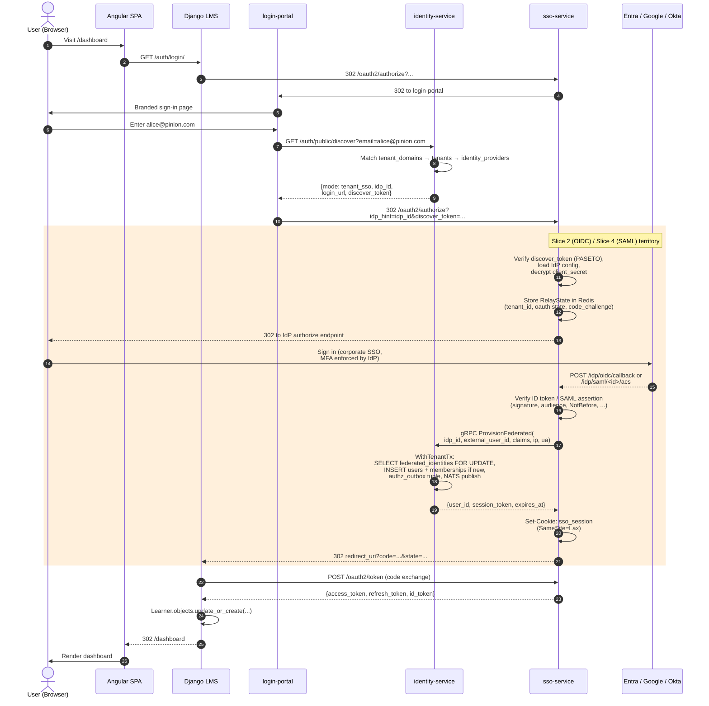
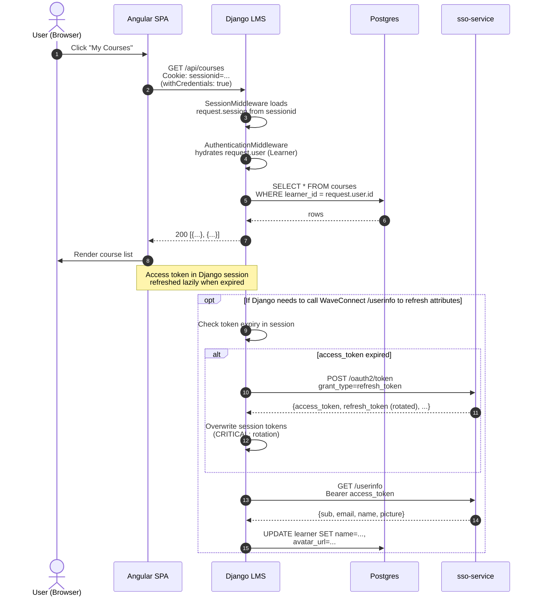
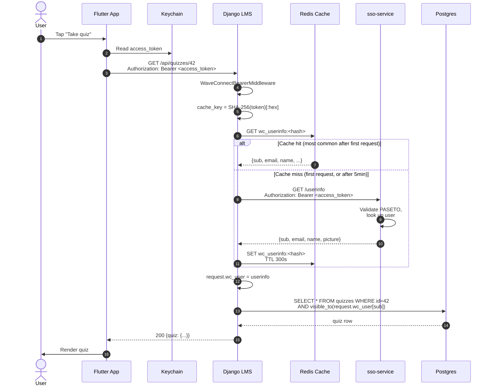
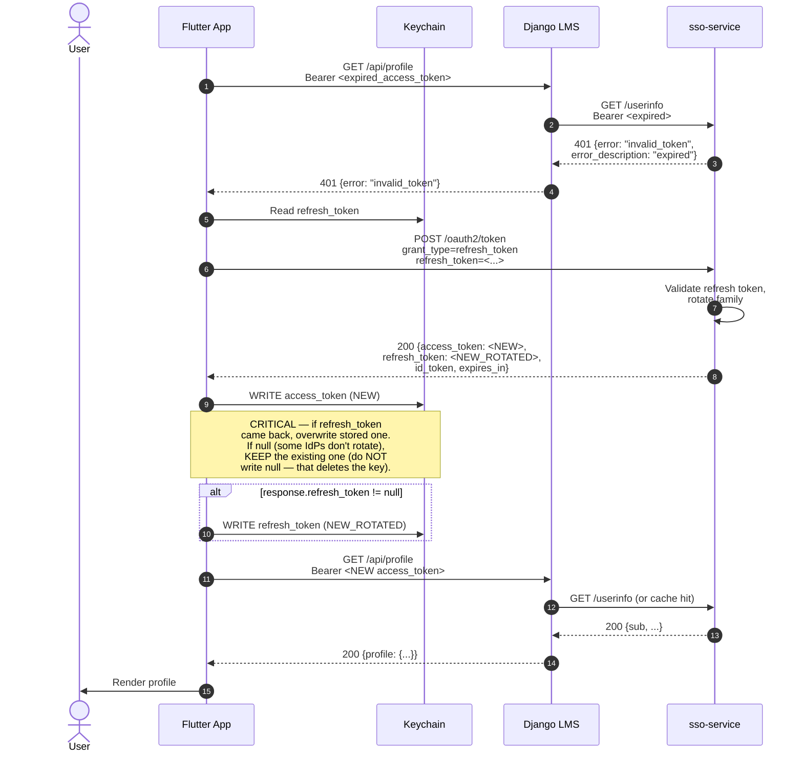
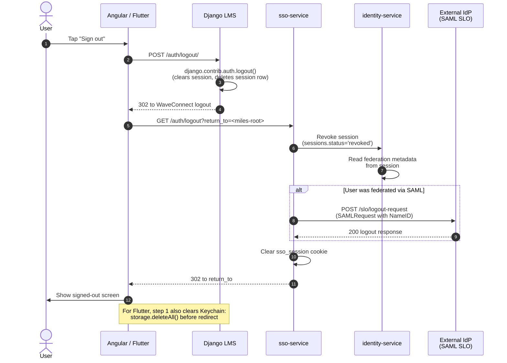
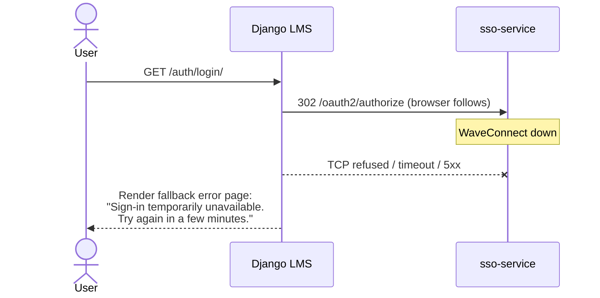
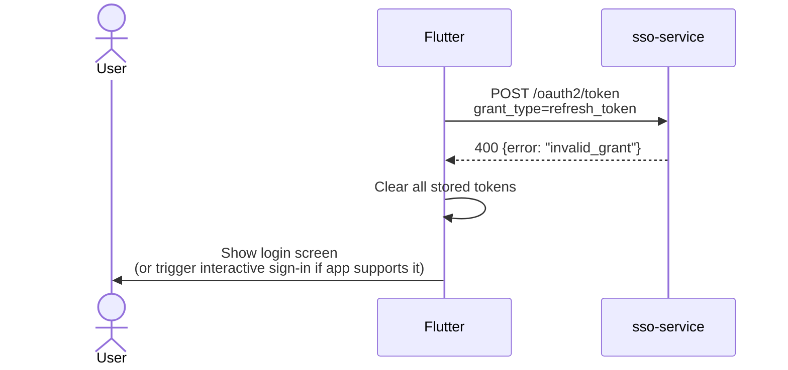
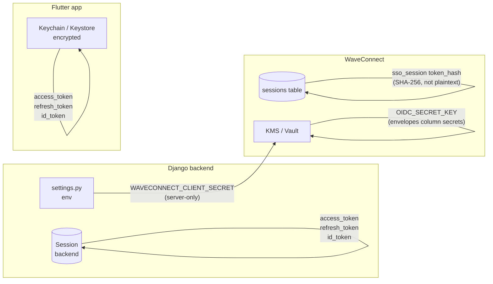

# Communication Flows — Miles Masterclass ↔ WaveConnect

End-to-end sequence diagrams for every interaction between the Miles
Masterclass frontends (Angular + Flutter), the Miles backend (Django),
and WaveConnect. Read [docs/integration-guide.md](../integration-guide.md)
first if you haven't — that doc covers the integration mechanics; this
one focuses on the runtime interactions.

> **Diagrams use Mermaid.** GitHub, GitLab, VS Code, and most modern
> Markdown viewers render them natively. If yours doesn't, the source is
> readable and copy-paste-able into [mermaid.live](https://mermaid.live).

---

## 1. Component overview

The three Miles surfaces (Angular web, Flutter mobile, Django backend)
talk to WaveConnect via two protocols:

- **Angular ↔ Django ↔ WaveConnect:** OIDC authorization-code flow with
  Django as a Backend-for-Frontend. Angular never sees WaveConnect tokens.
- **Flutter ↔ WaveConnect (direct), Flutter ↔ Django (bearer):** Flutter
  performs OIDC itself via `flutter_appauth`, then sends the access token
  to Django on every API call. Django validates via `/userinfo`.



---

## 2. Web sign-in — Angular + Django BFF (password tenant)

The default path for tenants without an external IdP configured. User
enters email + password on WaveConnect's branded login-portal; MFA
challenge if the tenant policy requires it.



**Key invariants:**

- The `state` parameter (line 4) and `code_verifier` (line 19) are
  generated by Authlib in Django and never leave the Django process.
  Angular has zero exposure to OIDC.
- The Django session cookie (line 30) is separate from WaveConnect's
  `sso_session`. They never cross domain boundaries.
- `sso_subject` (the OIDC `sub` claim) is the join key Django stores;
  emails can change without breaking the link.

---

## 3. Web sign-in — Angular + Django BFF (tenant with SSO)

Pinion-style scenario: the tenant has `require_sso=true` and an external
IdP (Entra/Google/Okta) configured. User types email at login-portal;
discover routes them to their IdP instead of the password screen.

> **Status:** Discover routing works today. Steps 9–14 (`sso-service`
> hand-off to external IdP + JIT) ship in Milestone A Slice 2 (OIDC) and
> Slice 4 (SAML). Steps 1–8 and 17–end work the same as section 2.



**RelayState is critical here.** Cookies don't reliably survive the
cross-site IdP round-trip (privacy-mode browsers, SameSite=Lax on POST
back from IdP), so the tenant binding lives in Redis keyed by an opaque
ID passed through the protocol's state parameter.

---

## 4. Authenticated API call — Angular (session cookie)

After sign-in, every Angular HTTP call rides on the Django session
cookie. No tokens in the browser, no JWT verification per-request.



**Performance note:** In steady state, only steps 1–7 run. The
`/userinfo` round-trip (steps 9–15) is rare — only when an attribute
sync is explicitly triggered or the cached attributes are stale.

---

## 5. Mobile sign-in — Flutter (direct OIDC, no BFF)

Flutter cannot use cookies easily, so it performs OIDC itself via
`flutter_appauth` and stores tokens in OS-encrypted secure storage.

```mermaid
sequenceDiagram
    autonumber
    actor U as User
    participant F as Flutter App
    participant BW as Safari VC /<br/>Chrome Custom Tabs
    participant LP as login-portal
    participant SSO as sso-service
    participant IDS as identity-service
    participant KC as Keychain (iOS) /<br/>Keystore (Android)

    U->>F: Tap "Sign in"
    F->>F: flutter_appauth.authorizeAndExchangeCode(<br/>clientId, redirectUri, scopes,<br/>PKCE verifier generated)
    F->>BW: Open WaveConnect /oauth2/authorize<br/>via OS-native browser surface
    BW->>SSO: GET /oauth2/authorize?...
    SSO->>LP: 302 to login-portal (no session yet)
    LP->>BW: Branded sign-in page
    U->>BW: Email + password + MFA
    LP->>IDS: POST /auth/login (+ MFA verify)
    IDS-->>LP: Set-Cookie: sso_session
    LP->>SSO: Redirect to /authorize with session
    SSO->>SSO: Mint authorization_code
    SSO-->>BW: 302 com.milesmasterclass.app:/oauth/callback?code=...
    BW->>F: OS resolves custom URI scheme,<br/>hands code back to Flutter
    F->>SSO: POST /oauth2/token<br/>(authorization_code grant,<br/>code_verifier — no client_secret,<br/>this is a public client)
    SSO->>SSO: Verify PKCE, mint tokens
    SSO-->>F: {access_token, refresh_token, id_token,<br/>expires_in: 900}
    F->>F: Verify id_token signature<br/>(library does this; uses /jwks.json)
    F->>KC: Persist access_token, refresh_token,<br/>id_token (encrypted at OS level)
    F->>U: Show home screen
```

**Why custom URI scheme:** Apple/Google block third-party apps from
intercepting `https://` redirects unless universal/app links are
configured. The `com.milesmasterclass.app:/oauth/callback` form is
registered in `Info.plist` (iOS) and `build.gradle` (Android), and the
OS hands the response back to Flutter. AppAuth handles this seamlessly.

---

## 6. Authenticated API call — Flutter (bearer token + Django cache)

Flutter sends the access token on every Django API call. Django
validates via WaveConnect's `/userinfo` and caches the result (5min
default) so the network hop only happens once per token per worker
cluster.



**Cache-key correctness:** SHA-256(token), not Python's built-in
`hash()`. The built-in is PYTHONHASHSEED-randomized and process-local;
gunicorn worker N's cache key for a given token differs from worker
N+1's. SHA-256 gives a stable cluster-wide key — important when Django
scales horizontally.

**TTL choice:** 5 minutes is shorter than the typical 15-minute
access-token lifetime. A revoked token stops working within at most 5
min without explicit cache invalidation. If revocation latency must be
faster, lower the TTL or wire a revocation webhook.

---

## 7. Token refresh — Flutter (rotating refresh tokens)

When the access token expires (HTTP 401), Flutter quietly refreshes and
retries.



**Refresh-token family rotation is enforced.** Sending an old (already-
rotated) refresh token revokes the entire family — every Flutter
instance signed into the same account is logged out. Treat the storage
write at step 11 as load-bearing.

---

## 8. Logout

Two scenarios: local-only logout (Django session ends, WaveConnect
session continues for other apps) vs full logout (WaveConnect session
ends too, plus SAML SLO if applicable).



**Why two hops (Django + WaveConnect):** Killing only the Django
session would leave the user still signed into WaveConnect. If they hit
another Miles property (or another tenant they belong to), they'd be
silently re-authenticated. The two-hop logout is the safe default; if
you want "Miles-only logout", skip the redirect to `/auth/logout` and
just clear Django's session.

---

## 9. Failure modes — what happens when…

### 9.1 WaveConnect is unreachable during sign-in



Django's Authlib has no retry on the authorize redirect (it's
browser-initiated). Surface a friendly error page with the correlation
ID; on recovery, the next click works.

### 9.2 Access token expired during a Flutter API call

Handled by section 7 (Token refresh). The 401 → refresh → retry loop is
transparent to the user.

### 9.3 Refresh token also expired (long absence)



Refresh-token TTL is typically 30 days. If the user has been away
longer, they re-authenticate from scratch.

### 9.4 Identity-service is down but sso-service is up

`/oauth2/token` and `/userinfo` work (sso-service reads its own
`sessions` table copy). New sign-ins fail because identity-service
issues sessions. Existing logged-in users continue to work until their
access tokens expire.

---

## 10. Where the secrets live



| Secret | Lives in | Never goes to |
|---|---|---|
| `WAVECONNECT_CLIENT_SECRET` (Django) | env var / KMS | the browser, mobile app, or logs |
| Django session cookie value | browser, signed by Django | external services |
| WaveConnect access + refresh tokens | Django DB-backed session ; Flutter Keychain | the Angular bundle, JS console, public logs |
| `sso_session` cookie | browser, opaque token | Django (different domain) |
| `OIDC_SECRET_KEY` (WaveConnect) | K8s Secret backed by KMS/Vault | git, env files committed to source |

---

## Cross-references

- [docs/integration-guide.md](../integration-guide.md) — the developer
  & admin onboarding guide. Code samples that produce the flows above.
- [docs/plans/execution-roadmap.md](../plans/execution-roadmap.md) —
  what's shipped vs rolling out. Sections 3 & 5 here flag what's still
  in flight.
- [docs/concepts/paseto-tokens.md](paseto-tokens.md) — internal token
  format reference. Not needed for integration but useful for security
  review.
- [AGENT.md](../../AGENT.md) — workspace map.
